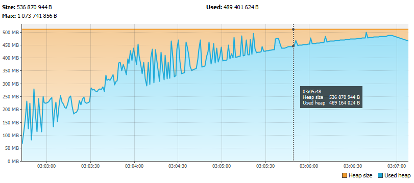
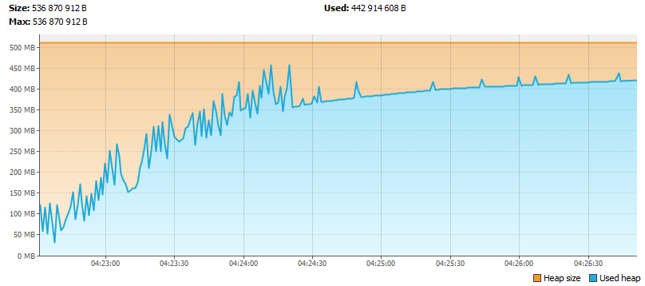
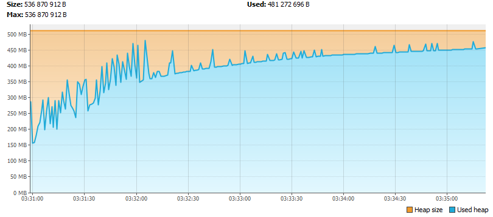

##Выводы:

Использовал три GC: G1, Parallel, Serial

Запускал c параметрами: 
-Xms512m -Xmx512m -XX:+HeapDumpOnOutOfMemoryError -XX:+UseG1GC 
-Xms512m -Xmx512m -XX:+HeapDumpOnOutOfMemoryError -XX:+UseParallelGC 
-Xms512m -Xmx512m -XX:+HeapDumpOnOutOfMemoryError -XX:+UseSerialGC

Сравнивал по времени работы приложения и времени работы GC. 
Программа работала вплоть до остановки с ошибкой OutOfMemory (java.lang.OutOfMemoryError: Java heap space).

### Результаты:
Параметр | G1GC | ParallelGC | SerialGC
--- | --- | --- | ---
Время работы приложения (time), сек | 261.953 | 258.803 | 306.159
Время работы GC (gc_time), сек | 109.542 | 129.122 | 164.209
Отношение gc_time/time, %  | 42 | 50 | 54
action:end of minor GC (количество) | 1190 | 303 | 250
action:end of major GC (количество) | 460 | 365 | 450
Количество циклов заполнения массива | 2311 | 2086 | 2264

Время работы приложения для G1GC и ParallelGC примерно одинаковое (~260 сек), для SerialGC на 45 сек дольше. 
Наименьшее время работы GC показал G1GC (109 сек и 42% от общего времени работы программы). 
Также наибольшее количество циклов заполнения массива до остановки приложения (2311) показал G1GC.

Таким образом, по выбранным критериям, для приложения предпочтительнее сборщик мусора G1GC. 

## G1 GC Heap

## Parallel GC Heap

## Serial GC Heap
